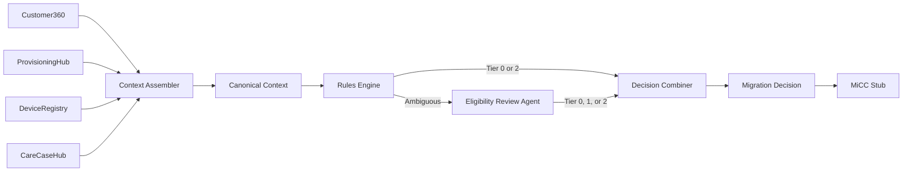

# Architecture

## Overview

The Control Tower sits between fragmented source systems and downstream migration execution (MiCC). It assembles a canonical view of each subscriber, applies deterministic rules, escalates ambiguous cases to a single review agent, and returns a structured decision.

## Canonical context fields

| Field | Source(s) | Notes |
|-------|-----------|-------|
| `subscriber_id` | All | Primary key |
| `brand` | Customer360 | `BrandMetadata`; policy overrides via `BrandPolicyHook` |
| `contract_type` | Customer360 | |
| `account_status` | Customer360 | |
| `billing_ok` | Customer360 | |
| `sim_status` | ProvisioningHub | |
| `provisioning_state` | ProvisioningHub | |
| `network_ready` | ProvisioningHub | |
| `prior_migration_state` | ProvisioningHub | |
| `device_model` | DeviceRegistry | |
| `is_5g_capable` | DeviceRegistry | |
| `requires_sim_swap` | DeviceRegistry | |
| `open_complaint` | CareCaseHub | |
| `recent_case_count` | CareCaseHub | |
| `escalation_flag` | CareCaseHub | |

## Module boundaries

| Package | Responsibility |
|---------|----------------|
| `domain` | Pydantic models, enums, reason codes, brand policy hook |
| `adapters` | Read placeholder data per source system |
| `context` | Merge adapter outputs into canonical context |
| `rules` | Deterministic Tier 0 / Tier 2 rules; mark AMBIGUOUS otherwise |
| `agent` | Single eligibility reviewer for ambiguous cases (any tier) |
| `decision` | Combine rule + agent outputs into final decision |
| `micc` | Stub queue receipt and simulated execution |
| `pipeline` | Wire the end-to-end flow |

## Implementation order

1. Domain models
2. Synthetic dataset
3. Rules engine
4. Eligibility review agent
5. Decision combiner
6. MiCC stub
7. Streamlit UI
8. Tests

## Out of scope (MVP)

- Real OSS/BSS integrations
- Multiple agents or orchestration frameworks
- Production-grade execution engine
- Cloud infrastructure
